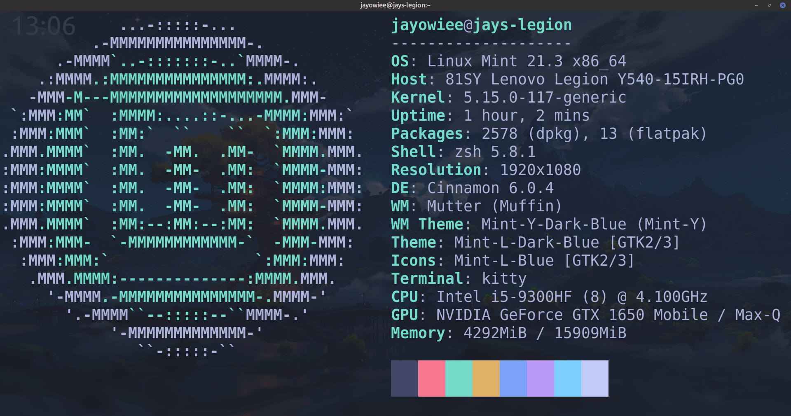
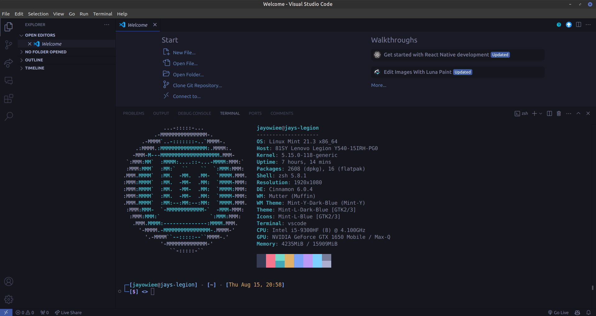

# terminal-configs
All of my config files which I'd be using on Xubunutu 22

## Preview

### Kitty Terminal

### VS Code

## Software

### Oh My Zsh (bash alternative)

Oh My Zsh is a delightful, open source, community-driven framework for managing your Zsh configuration. It comes bundled with thousands of helpful functions, helpers, plugins, themes, and a few things that make you shout...
>**"Oh My ZSH!"**

### Kitty

The fast, feature-rich, GPU based terminal emulator Fast Offloads rendering to the GPU for lower system load, Uses threaded rendering for absolutely minimal loadtimes.

### VS Code
Visual Studio Code, also commonly referred to as VS Code, is a source-code editor developed by Microsoft for Windows, Linux, macOS and web browsers. Features include support for debugging, syntax highlighting, intelligent code completion, snippets, code refactoring, and embedded version control with Git.

## References

- [Oh My Zsh!](https://ohmyz.sh/)
- [Kovid Goyal - Kitty](https://sw.kovidgoyal.net/kitty/)
- [VS Code](https://code.visualstudio.com)
- [Tokyo Night VS Code theme](https://marketplace.visualstudio.com/items?itemName=enkia.tokyo-night)
- [Kitty terminal theme - Tokyonight (vim inspired)](https://github.com/davidmathers/tokyo-night-kitty-theme)