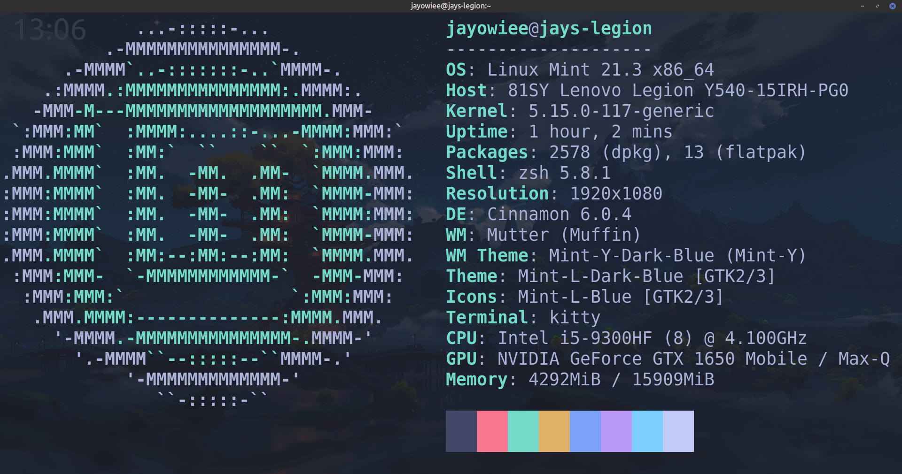

# terminal-configs
All of my config files which I'd be using on Xubunutu 22

## Preview

### Kitty Terminal

## Software

### Oh My Zsh (bash alternative)

Oh My Zsh is a delightful, open source, community-driven framework for managing your Zsh configuration. It comes bundled with thousands of helpful functions, helpers, plugins, themes, and a few things that make you shout...
>[**"Oh My ZSH!"**](https://ohmyz.sh/)

### Kitty

The fast, feature-rich, GPU based terminal emulator Fast Offloads rendering to the GPU for lower system load, Uses threaded rendering for absolutely minimal loadtimes.
>[Kovid Goyal - Kitty](https://sw.kovidgoyal.net/kitty/)
